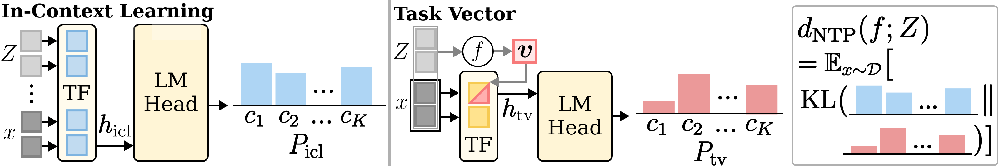
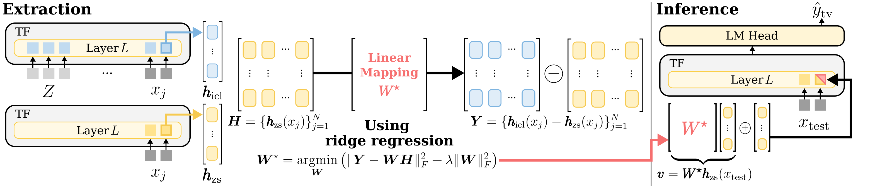

# Distributional Alignment as a Criterion for Designing Task Vectors in In-Context Learning

This repository contains the official implementation of the metric and method proposed in **Distributional Alignment as a Criterion for Designing Task Vectors in In-Context Learning.**

## Methodology Overview
We posit that **probabilistic alignment with ICL is a key desideratum** for effective task vector extraction methods, and accordingly propose **d<sub>NTP</sub>** and **Linear Task Vector (LTV)**.

### 1) Metric: d<sub>NTP</sub>
<p align="center">
  
</p>

- It quantifies **task vector quality by measuring the discrepancy between the predictive distribution** under TV-based inference and that under ICL-based inference, in terms of next-token probability (NTP).
- Empirically, lower d<sub>NTP</sub> correlates strongly with higher downstream performance, making it a reliable indicator of TV quality.

### 2) Method: Linear Task Vector (LTV)
<p align="center">
  
</p>

- At extraction, LTV employs **a linear mapping that transforms zero-shot hidden states into estimated demonstration effects** via a closed-form ridge regression.
- At inference, the task vector obtained **by applying the optimal linear mapping to the zero-shot hidden state**, then injected into the model.
- LTV is designed to minimize d<sub>NTP</sub>, aligning TV inference with ICL.

## Installation
- `setup.sh` creates `.venv`, upgrades pip, and installs `requirements.txt`.
- Run the setup script:
```bash
bash ./setup.sh
source .venv/bin/activate
```

## Experimental Setup
### Models
We evaluate our method on these models:
- Llama Series: `meta-llama/Llama-2-7b-hf`, `meta-llama/Llama-2-13b-hf`, `meta-llama/Llama-3.1-8B`
- Qwen Series: `Qwen/Qwen2.5-7B`, `Qwen/Qwen3-8B`

### Data
The `./our_datasets` directory contains eight benchmarks used in our experiments.
- AGNEWS, DBPedia, HateSpeech18, MR, SST-2, SST-5, SUBJ, TREC

### Environment
For reproducibility, we report the hardware and software environment used in our study.
- Python: 3.13.2 / CUDA: 12.2 / NVIDIA driver: 535.247.01
- GPU: NVIDIA RTX 6000 Ada Generation or NVIDIA GeForce RTX 4090 (single GPU setup)

## Running Experiments

### 1) Metric: d<sub>NTP</sub>
The main execution script is `run/run_our_metric.sh`. It calls `run/run_our_metric.py` with the config file. It computes our metric d<sub>NTP</sub> by loading saved logits, aggregating per‑dataset results, and plotting the results.

```bash
bash ./run/run_our_metric.sh
```

You can configure the parameters in `config/config_our_metric.py`
- **Key Parameters**
  - `result_dir` : base directory containing saved logits

### 2) Method: LTV
The main execution script is `run/run_our_ltv.sh`. It calls `run/run_our_ltv.py` with the config file. The script runs a unified baseline evaluation covering zero‑shot ICL, few‑shot ICL, and LTV.

```bash
bash ./run/run_our_ltv.sh
```

You can configure the parameters in `config/config_our_ltv.py`
- **Key Parameters**
  - `num_shot` : number of shots (k), which ensures label balance by including the maximum possible examples per label without exceeding k
  - `num_train_queries` : number of training queries used to extract LTV
  - `ridge_lambda` : regularization strength for LTV
  - `compute_d_NTP` : enable our metric d<sub>NTP</sub> evaluation

## Acknowledgments
We gratefully acknowledge the following repositories, which served as the foundation for this work:
- [I2CL: Implicit In-context Learning](https://github.com/LzVv123456/I2CL)
- [Task Vector: In-Context Learning Creates Task Vectors](https://github.com/roeehendel/icl_task_vectors)
